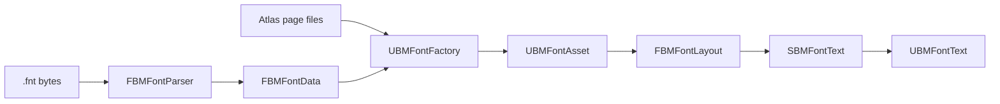

# Architecture

Unreal BMFont uses a narrow pipeline so each responsibility can be tested without a UMG scene.

## Modules

### UnrealBMFont (Runtime)

- Owns serializable data structures and `UBMFontAsset`.
- Parses descriptors without any Editor dependency.
- Converts a Unicode string into positioned bitmap glyphs.
- Paints glyph UV rectangles through Slate brushes.
- Exposes the UMG `UBMFontText` wrapper.

### UnrealBMFontEditor (Editor)

- Registers the modern Asset Definition.
- Imports `.fnt` descriptors and their page textures.
- Tracks source data and implements reimport.
- Contains importer-specific automation coverage.

### UnrealBMFontTests (Editor)

- Tests parser and layout behavior through public Runtime APIs.
- Is an Editor module, so it cannot enter game targets or packaged builds.

## Data ownership

`UBMFontAsset` owns descriptor metadata and hard references to imported page textures. It also maintains a non-serialized kerning lookup and a data revision used by Slate caches. Reimport replaces the serializable model, rebuilds the lookup, and invalidates layout/brush caches through that revision.

## Layout model

Layout decodes Unicode scalar values, resolves fallback glyphs, applies pair kerning and tracking, uses Unreal's line-break iterator, and produces positioned quads. The wrapping scan is linear per paragraph. It deliberately does not invoke Unreal's font shaping pipeline because the source data contains bitmap rectangles rather than a font face.

## Rendering model

`SBMFontText` is an `SLeafWidget`. It builds one brush per available glyph and emits Slate boxes using the correct page texture and UV region. All glyphs on the same texture/layer remain eligible for Slate batching. Layout is cached by text, font data revision, settings, and resolved wrapping width.

## Text model

The core accepts plain text and maps each code point through the BMFont layout and paint primitives. Rich Text markup is outside the core API. A future optional adapter can parse markup into runs and submit each BMFont run to the same primitives.
