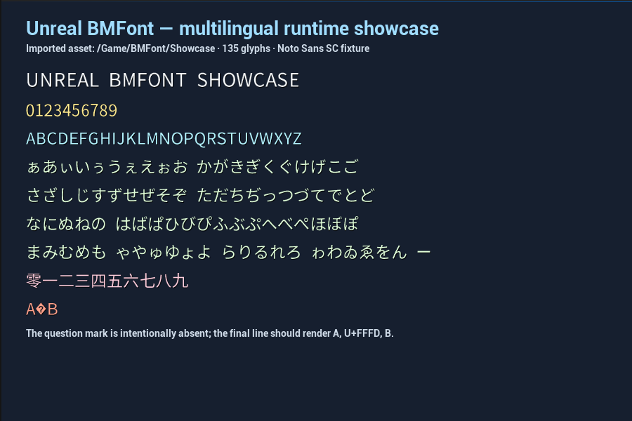

<p align="center">
  
</p>

# Unreal BMFont

Unreal BMFont imports AngelCode BMFont descriptors and renders their bitmap glyphs in Slate and UMG. The core widget is a purpose-built plain-text bitmap-font counterpart to `UTextBlock`, with a compact layout and rendering pipeline tailored to BMFont assets.

The plugin is currently beta (`0.3.0`). Its runtime API is small and usable, but compatibility beyond the verified matrix is not claimed yet.

[简体中文](README.zh-CN.md) · [Format support](Docs/FormatSupport.md) · [Architecture](Docs/Architecture.md) · [Testing](Docs/Testing.md)



## Highlights

- Imports text, XML, and binary v3 `.fnt` descriptors.
- Imports and references the descriptor's real page files, including multi-page atlases.
- Preserves Unicode code points, glyph offsets/advances, line metrics, and kerning pairs.
- Provides `UBMFontAsset`, `UBMFontText`, the lower-level `SBMFontText` Slate widget, and the `UBMFontRichTextBlock` rich text adapter.
- Renders packed-channel atlases through a channel-extraction UI material, honoring each glyph's `char.chnl` mask.
- Supports BMFont runs inside Rich Text, including empty tags and ellipsis overflow policies.
- Supports wrapping, justification, margins, line-height control, letter spacing, tint, shadow, fallback glyphs, text bindings, and pixel snapping.
- Supports asset reimport while preserving user-edited texture filtering.
- Ships editor thumbnails and a read-only font/atlas inspector with glyph rectangles.
- Keeps runtime, editor/importer, and automation-test modules separate.
- Applies configurable resource limits to malformed or oversized descriptors, unsafe page paths, atlas bounds, and multi-page atlas declarations with actionable logs.
- Keeps plain-widget brush creation proportional to glyphs used by the current layout, including on large Unicode assets.

## Requirements

- Unreal Engine 5.8
- A C++ project or an installed precompiled plugin package

Win64 is the currently verified build and runtime-test platform. See [Compatibility](Docs/Compatibility.md) before relying on other engine versions or platforms.

## Install

1. Copy this repository to `<YourProject>/Plugins/UnrealBMFont`.
2. Regenerate project files if your project uses source builds.
3. Build the project and enable **Unreal BMFont** in the Plugins window.
4. Restart the editor when prompted.

For a distributable plugin package, use:

```powershell
pwsh ./Scripts/BuildPlugin.ps1 -EngineRoot "C:\Program Files\Epic Games\UE_5.8"
```

The wrapper creates a clean plugin staging copy that excludes known local build products and writes to a timestamped directory under `%TEMP%` by default. Pass `-OutputDirectory` to choose another empty directory outside the plugin source tree.

## Use

1. Export an AngelCode BMFont descriptor and keep every referenced page image beside the `.fnt` file.
2. Import the `.fnt` file into the Content Browser. Unreal BMFont creates a `BMFont` asset and imports its page textures.
3. Add **BMFont Text** from the UMG palette.
4. Assign the imported font asset and set `Text`.
5. If the replacement character (`U+FFFD`) is not in the atlas, set `Fallback Codepoint` to a glyph that is present, commonly `?` (`63`).

The repository includes a tiny original fixture under [`Samples/Minimal`](Samples/Minimal) and a multilingual manual-validation fixture under [`Samples/Showcase`](Samples/Showcase). Showcase covers digits, uppercase Latin, Hiragana, Chinese numerals, and fallback behavior.

## Deliberate scope

BMFont stores already-rasterized glyph rectangles. It is not a font shaping engine. The current renderer is suitable for Latin, CJK, digits, icons, and other left-to-right precomposed glyph sets. It does not implement bidirectional layout, OpenType shaping, or ligatures. The rich text adapter measures each run independently, so kerning does not cross tag boundaries. Packed-channel atlases render through the bundled channel-extraction material; outline channels are not composited separately.

These boundaries are explicit in [Format support](Docs/FormatSupport.md) and tracked in [Roadmap](ROADMAP.md).

## Development

Run the dependency-free repository hygiene checks first:

```powershell
python ./Scripts/ValidateRepository.py
```

The automated suite exercises bounded descriptor parsing, deterministic malformed-input corpora, Unicode scalar handling, kerning, wrapping, line metrics, large-glyph-set caching, real PNG import, texture defaults, reimport, and GPU rendering. Run it against any host project containing the packaged plugin:

```powershell
pwsh ./Scripts/TestPlugin.ps1 `
  -EngineRoot "C:\Program Files\Epic Games\UE_5.8" `
  -Project "D:\Projects\BMFontHost\BMFontHost.uproject"
```

After producing a package with `BuildPlugin.ps1`, verify real Development and Shipping cooks and launches with:

```powershell
pwsh ./Scripts/TestPackagedRuntime.ps1 `
  -EngineRoot "C:\Program Files\Epic Games\UE_5.8" `
  -PluginPackage "$env:TEMP\UnrealBMFont-Package"
```

See [Contributing](CONTRIBUTING.md) for the complete workflow.

## License

Unreal BMFont is available under the [MIT License](LICENSE). No third-party source code or font files are bundled; see [Third-party notices](THIRD_PARTY_NOTICES.md) for the provenance of the generated Showcase atlas.
